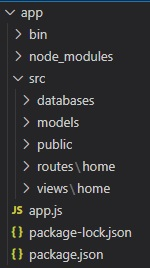

백엔드 맛보기
=============

* Expres 서버생성
```
const express = require('express');
const app = express();
const PORT = 3000;
app.listen(PORT, () => {
    console.log('server on');
});
```
* ejs 세팅 - views 폴더 세팅   
```
app.set('views', './src/views');
app.set('view engine', 'ejs');
```
* home, login 화면 생성
* 라우터 세팅 및 라우팅
### routes/home/index.js
```
const express = require('express');
const router = express.Router();

router.get('/', (req, res) => {
    res.render('home/index');
})
module.exports = router;
```
### app.js
```
const home = require('./routes/home');
app.use('/', home);
```
* public 폴더 세팅
* bodyparser 세팅
```
app.use(express.static(`${__dirname}/src/public`));

app.use(express.json());
app.use(express.urlencoded({ extended: true }));
```
* 폴더 구조 최적화   

```
'use strict';
```
```
npm init
```
* routes/home/home.ctrl.js 에서 users 데이터 두고 로그인 구현
```
function login() {
    const req = {
        id: id.value, 
        psword: psword.value, 
    }

    fetch('/login', {
        method: 'POST', 
        headers: {
            "Content-Type": "application/json", 
        }, 
        body: JSON.stringify(req), 
    })
    .then((res) => res.json())
    .then((res) => {
        if (res.success) location.href = '/';
        else alert(res.msg);
    })
    .catch((err) => console.error('로그인 중 에러 발생'));
};
```
* users 데이터 -> UserStorage class로 옮겨 getUsers를 통해 users 전달 및 로그인 구현

> 현재는 ctrl -> UserStorage 를 통해 로그인하지만   
> ctrl -> User -> UserStorage 로 로그인되게 변경할거임 
```
const user = new User(req.body);
const response = user.login();
return res.json(response); 
```

* User 클래스 생성(with constructor)
> User.login() 안에서 UserStorage.getUserInfo(id) 를 통해 유저정보 받아오고   
> req.body 의 정보랑 비교 후 로그인 처리   
> ctrl로 response를 반환한다.   
> 이 과정에서 ctrl에서 처리하던 로그인 로직은 없어짐

### register 시작
> 프론트 만들고 연결된 js파일에서 회원가입 시 /register POST 요청   
> ctrl에서 받고 User.register() 진행   
> this.body 는 인식하기 쉽게 client 로 바꿔 쓰자   
> User.register() -> UserStorage.save(this.body) 로 저장 로직 추가

* DB를 대신해 파일 fs로 읽기
```
fs.readFile('./src/databases/users.json', (err, data) => {
```
> data 출력하면 16진수 Buffer 데이터로 출력됨   
> -> JSON.parse() 사용   
> data는 잘 가져오나 결과값을 리턴하는 과정에서 문제 생길거임   
```
const fs = require('fs').promises;
```
> fs은 이제 promise를 반환하게된다. 그럼 뭐다? then, catch 사용   
> 근데 then에서 반환시킬 return 값을 console로 찍어보면 Promise{<pending>} 이 나온다.   

* async, await 적용 후 테스트
> userStorage.getUserInfo() 안의 then 에 들어가는 코드 더러우니 따로 정리   
```
static #getUserInfo() {~
```
> then의 파라미터와 원래 getUserInfo의 파라미터도 같이 전달   
> 이런 private 한 변수나 메서드는 항상 최상단에 올려주도록 하자   

* fs로 파일에 데이터 쓰기
> UserStorage.save()에서 시작
```
fs.writeFile('./src/databases/users.json', data);
```

> getUsers() 메서드 수정, private한 메서드 따로 빼서 정리   
> async await 적용   
> getUsers(true) 적용   
> fs로 저장할 때는 JSON 형태로

* error 처리
> UserStorage.save() 에서   
```
return new Error('이미 존재하는 아이디입니다.');
```
> 위와 같은 형태로 중복 아이디에 대한 에러를 내고 있는데 이 상태면 그냥 에러 싸고 끝임   
> User에서 try catch로 받기위해   
```
throw Error('이미 존재하는 아이디입니다.');
```
> throw 로 던지는겨   
> 이제 User 에서 catch 로 받아   
```
return { success: false, msg: err };
```
> 하려고 하는데 이 response.msg 는 Object 형태임   
> Error('~~') 때문에 그러는건데 걍   
```
throw ('~~')
```
> 이렇게 바꿔주자
