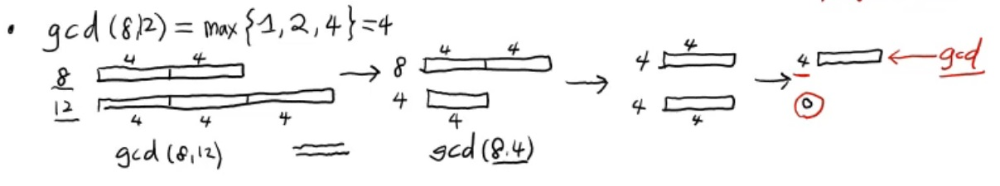

자료구조
========
자료를 담는 구조   
자료 == data   
data는 컴퓨터에 저장해야되기 때문에 저장공간(memory)이 있어야함.   
저장만 하면 되는게 아니라   
\+ 읽기, 쓰기, 삽입, 삭제, 탐색 할 수 있어야 한다.   
위 5가지 행위는 자료구조를 위해서 지원되는 연산들   

즉, **memory와 연산으로 구성된 형태**가 **자료구조**이다.   
쉽게말해 자료를 담는 구조

지원되는 연산에 따라 다양한 종류의 자료구조가 존재한다.   

알고리즘
========
위 자료구조의 저장된(입력된) 자료(data)를 가지고   
**문제를 푸는 논리적인 절차**가 바로 **알고리즘**이다.

유한한 횟수의 연산들을 반복해서 원하는 정답을 출력하는 절차라고도 말할 수 있겠다.

자료구조 예시)
--------------
### 변수(variable)
```
변수 이름 a라는 값에 대한
a = 5 // (쓰기 연산)
print(a) // (읽기 연산)
하나의 값만 들어있기 때문에 삽입, 삭제, 탐색은 할 수 없다.
```

### 배열(array) 혹은 리스트(list)
```
A=[3, -1, 5, 7]
접근: 각 원소의 index
읽기, 쓰기: 리스트의이름[index]
여러개의 값이 들어있기 때문에 삽입 가능
삽입: A.append(9), A.insert
삭제: A.pop(), A.pop(2)
```

알고리즘 예시)
--------------
```
100개의 정수: 리스트 A: 입력
-> 오름차순 정렬: 출력
```
### 인류 최초의 알고리즘: 최대공약수(GCD) 계산 알고리즘 (By Euclid)   

유클리드는 두 수의 최대공약수를 구하기 위해 긴 막대기를 사용했다.   
A, B 두 막대기를 준비.   
길이가 긴 막대기에서 작은 막대기 만큼 빼고 남은 길이의 막대기가 남았을 때,   
전과 후의 최대공약수는 같다는 점에 착안.   
그림으로 나타내면 다음과 같다.   


### 파이썬 코드로 나타내면
```
gcd(a, b): 
    while a != 0 and b != 0 : 
        if a > b : a = a - b
        else : b = b - a
    return a + b  
```
한쪽이 0 이 되면 반대쪽을 리턴하기 위해 if문을 쓰는 방법도 있지만   
어차피 한쪽이 0 이기 때문에 a + b를 통해 간단히 나타낼 수 있다.   

> gcd(2, 100) 일 경우 2를 빼는 while 안 코드 50번 반복하게됨   
> 이 행위는 한쪽이 0 이 될 때까지 반복하는거니까   
> 0 이라는 나머지를 구하는 행위와 같다.   
> 이러지 말고 a 를 b 로 나눈 나머지를 구하면 되지 않을까? (a > b)   
```
gcd(2, 100) -> gcd(2, 0)
1번만에 구하기 가능
```

> 첫번째 방법: gcd_sub (빼기)   
> 두번째 방법: gcd_mod (나머지)   
> 세번째 방법: gcd_rec (재귀적) : gcd(a, b) = gcd(a, b % a) or gcd(a % b, b)


